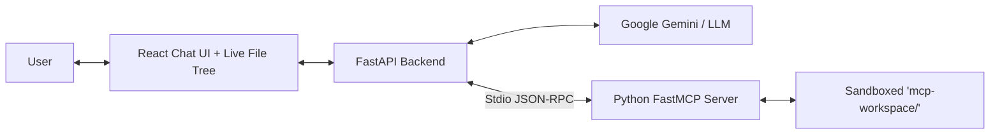

# 🤖 AI Filesystem Chatbot (MCP-Powered)

An interactive, web-based filesystem chatbot powered by the **Model Context Protocol (MCP)** and **Google Gemini** (Gemini 2.5 Flash / Gemini Pro). Built with **Python FastMCP**, **FastAPI**, and **React + Tailwind CSS**.

Users can speak naturally to create, read, update, list, and delete files inside a safe, sandboxed workspace, with real-time visual feedback in a live file explorer.

---

## 🌟 Architecture Overview



| Component | Technology | Responsibility |
|---|---|---|
| **Frontend** | React 19, Vite, Tailwind CSS, Lucide | Chat interface, live workspace tree, tool call badges, deletion confirmation prompt |
| **Backend** | Python 3.12, FastAPI, Uvicorn | Orchestrates Gemini tool-calling loop, translates MCP schemas, handles confirmation gate |
| **MCP Server** | Python `mcp` SDK (FastMCP) | Implements the 6 filesystem tools, enforces strict sandbox containment |
| **Sandbox** | `server/sandbox.py` | Canonical path resolution preventing directory traversal (`../`, root, system paths) |

---

## 🛠️ The 6 MCP Tools

1. **`create_folder(folder_path)`**: Creates a directory recursively.
2. **`create_file(file_path, content)`**: Creates a new text file.
3. **`read_file(file_path)`**: Reads and returns file content.
4. **`list_folder(folder_path)`**: Lists files and folders with sizes.
5. **`update_file(file_path, content, mode)`**: Overwrites or appends to a file.
6. **`delete_item(path, recursive)`**: Permanently deletes a file/folder (**guarded by human confirmation**).

---

## 🚀 Quick Start Guide

### 1. Configure API Key
Open `.env` in the root folder and add your Google Gemini API key:
```env
GEMINI_API_KEY=AIzaSy...
```

### 2. Launch Servers

**Option A (One-Click Launch on Windows):**
Double-click `start_servers.bat` or run:
```powershell
.\start_servers.bat
```

**Option B (Manual Launch):**
*Terminal 1 (Backend):*
```powershell
.\venv\Scripts\activate
uvicorn backend.main:app --reload --port 8000
```
*Backend API will run at `http://127.0.0.1:8000` (API docs at `http://127.0.0.1:8000/docs`).*

*Terminal 2 (Frontend):*
```powershell
cd frontend
npm run dev
```
*Open `http://localhost:5173` in your browser!*

---

## 🛡️ Security & Sandbox Guarantee
All file operations are strictly confined within `mcp-workspace/`. Any attempt to escape via path traversal (e.g. `../../`, absolute paths, symlinks) is blocked at the sandbox layer with a `PermissionError` and returned safely to the user.

---


## 🧪 Running Automated Tests

Run the core unit and integration test suite (31 tests):
```powershell
.\venv\Scripts\python -m unittest discover tests
```

Run the comprehensive 120-prompt automated benchmark:
```powershell
.\venv\Scripts\python scripts/run_full_suite.py
```
