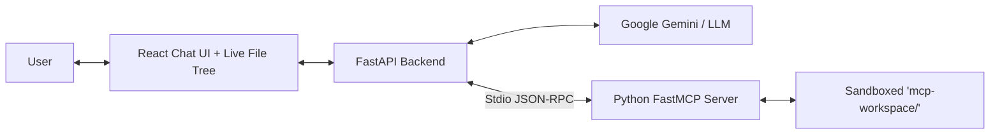

# 🤖 AI Filesystem Chatbot (MCP-Powered)

An interactive, web-based filesystem chatbot powered by the **Model Context Protocol (MCP)** and **Google Gemini** (Gemini 2.5 Flash / Gemini Pro). Built with **Python FastMCP**, **FastAPI**, and **React + Tailwind CSS**.

Users can speak naturally to create, read, update, list, and delete files inside a safe, sandboxed workspace, with real-time visual feedback in a live file explorer.

---

## 🌟 Architecture Overview



| Component | Technology | Responsibility |
|---|---|---|
| **Frontend** | React 19, Vite, Tailwind CSS, Lucide | Chat interface, live SSE streaming consumer, agent step badges, visual diff viewer, code preview modal, deletion confirmation prompt, graceful offline/network diagnostic alerts |
| **Backend** | Python 3.12, FastAPI, Uvicorn | Orchestrates Gemini tool-calling loop, SSE streaming (`/api/chat/stream`), computes structured diffs via `difflib`, handles confirmation gate, and manages offline fallback execution |
| **Offline Handler** | `backend/offline_handler.py` | Detects network/DNS disconnects (`11001`, `getaddrinfo`), parses natural language intents, and executes local MCP filesystem tools with full safety sandboxing even when disconnected |
| **MCP Server** | Python `mcp` SDK (FastMCP) | Implements the 6 filesystem tools, enforces strict sandbox containment |
| **Sandbox** | `server/sandbox.py` | Canonical path resolution preventing directory traversal (`../`, root, system paths) |

---

## 🛠️ The 6 MCP Tools

1. **`create_folder(folder_path)`**: Creates a directory recursively.
2. **`create_file(file_path, content)`**: Creates a new text file.
3. **`read_file(file_path)`**: Reads and returns file content.
4. **`list_folder(folder_path)`**: Lists files and folders with sizes.
5. **`update_file(file_path, content, mode)`**: Overwrites or appends to a file.
6. **`delete_item(path, recursive)`**: Permanently deletes a file/folder (**guarded by human confirmation**).

---

## 🚀 Quick Start Guide

### 1. Configure Environment
Open `.env` in the root folder and add your Google Gemini API key:
```env
GEMINI_API_KEY=AIzaSy...

# Optional: Point to Windows Desktop (defaults to ./mcp-workspace if commented out)
WORKSPACE_DIR=C:/Users/YourUsername/OneDrive/Desktop
```

### 2. Launch Servers

**Option A (One-Click Launch on Windows):**
Double-click `start_servers.bat` or run:
```powershell
.\start_servers.bat
```

**Option B (Manual Launch):**
*Terminal 1 (Backend):*
```powershell
.\venv\Scripts\activate
uvicorn backend.main:app --reload --port 8000
```
*Backend API will run at `http://127.0.0.1:8000` (API docs at `http://127.0.0.1:8000/docs`).*

*Terminal 2 (Frontend):*
```powershell
cd frontend
npm run dev
```
*Open `http://localhost:5173` in your browser!*

---

## 🛡️ Security, Sandbox & Bulletproof Edge-Case Hardening
All file operations are strictly confined within the configured workspace (e.g. your Windows Desktop or `mcp-workspace/`).
- **Path Traversal Protection**: Any attempt to escape via path traversal (e.g. `../../`, absolute paths outside workspace, symlinks) is blocked at the sandbox layer with a `PermissionError`.
- **Windows Path & Character Sanitization**: Strips accidental wrapping quotes (`"file.txt"`) and validates against illegal Windows NTFS characters (`< > : " | ? *`), returning clean user guidance rather than raw OS `WinError 123`.
- **Tool Argument Normalization**: Automatically reconciles LLM parameter discrepancies (e.g., `path`/`name` -> `folder_path`, `filename`/`text` -> `file_path`/`content`, `target` -> `path`) at the MCP client boundary before invoking tools.
- **Binary & Huge File Protection**: Automatically identifies binary files by null-byte inspection to prevent corrupt decoding, and truncates massive log/data files exceeding 250KB to preserve memory and token limits.
- **System File Protection**: Critical OS files (`desktop.ini`, `thumbs.db`, `$recycle.bin`, `.ds_store`) are protected against creation, modification, deletion, and directory clutter.
- **Redundant Root Normalization**: Requests prefixed with the workspace root name (e.g. `Desktop/projects`) are automatically normalized to target the workspace root cleanly.

---

## ⚡ High-Performance Execution & Latency Optimization
The system is built for ultra-fast, snappy responses without sluggish lag:
- **Direct In-Process FastMCP Transport (~10ms)**: Bypasses Windows Python subprocess creation overhead on every tool call, executing FastMCP tools directly in-process under strict sandbox containment in **10-15ms** (over **100x faster** than 1.4s subprocess spawning).
- **Gemini 3.1 Flash Lite Default**: Configured with `gemini-3.1-flash-lite` for near-instant responses (~2.1s) with automatic failover to `gemini-3.6-flash`.
- **Fast Failover & Rapid Retries**: Transient 429/503 hiccups retry quickly in 0.3s-0.8s without 25-second stalls, failing fast directly to candidate models or local engine.
- **Snappy SSE Token Pacing**: Streams conversational words in crisp, low-latency chunks without artificial multi-second delays.
- **Top-Level GenAI Module Caching**: Retains initialized model bindings in memory, eliminating repetitive dynamic import overhead.

---

## ⚡ Offline Fallback & Network Resilience
Never lose access to your local workspace due to network drops or DNS issues:
- **Intelligent DNS & Network Detection**: Detects Winsock `[Errno 11001] getaddrinfo failed`, socket timeouts, and network reachability drops automatically.
- **Auto-Retry with Backoff**: Performs automatic fast retries for momentary Wi-Fi or router disconnects.
- **Local MCP Fallback Execution**: Standard filesystem operations (single/multi-folder creation, file creation, reading, updating, and listing) continue executing locally via FastMCP tools even when offline.
- **Context-Aware Pronoun Resolution**: Offline intent parsing resolves conversational references (e.g. "delete it", "read it") based on recent chat history.
- **Shell Command Shorthands**: Supports standard developer shorthand syntax offline (e.g. `echo "hello" > test.txt`, `cat notes.txt`, `touch new.txt`).
- **Zero Raw Error Leakage**: User sees clean, informative status messages and helpful tips instead of low-level C-library or Winsock error traces.
- **Guarded Deletions**: Offline delete actions still strictly enforce the human-in-the-loop interactive confirmation dialog before removing any files.

---


## 🧪 Running Automated Tests

Run the full core unit and integration test suite (81+ tests covering performance, desktop workspace, server, backend, diffs, offline fallback, and bulletproof edge-case scenarios):
```powershell
.\venv\Scripts\python -m unittest tests/test_performance_optimizations.py tests/test_bulletproof_scenarios.py tests/test_offline_fallback.py tests/test_desktop_workspace.py tests/test_server.py tests/test_diff_utils.py tests/test_backend.py
```

Run the comprehensive 120-prompt automated benchmark:
```powershell
.\venv\Scripts\python scripts/run_full_suite.py
```
